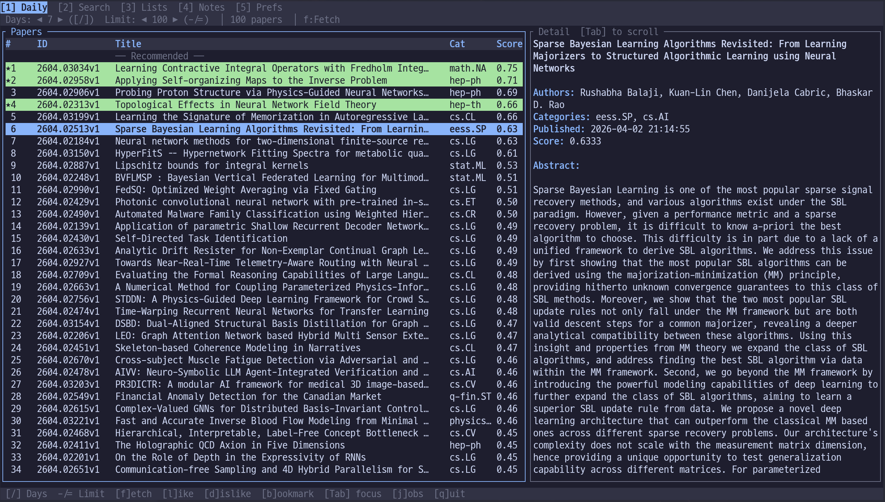

# arXiv Explorer

Personalized arXiv paper recommendation and management system with CLI and TUI interfaces.



## Features

- **Personalized Recommendations** — TF-IDF content similarity + category/keyword/recency scoring
- **Reading Lists** — Organize papers into named lists with reading status tracking
- **Paper Notes** — Attach typed notes (general, question, insight, todo) to any paper
- **AI Summaries** — Generate summaries via configurable AI providers (Gemini, Claude, OpenAI, Ollama, or custom)
- **Translation** — Translate paper titles and abstracts via AI
- **Export** — Markdown, JSON, CSV export for papers, lists, and notes
- **TUI** — Full terminal UI with tabs, detail panels, and keyboard shortcuts
- **Paper Cache** — SQLite-backed cache eliminates redundant arXiv API calls

## Requirements

- Python 3.11+
- [uv](https://docs.astral.sh/uv/) package manager

## Installation

```bash
git clone https://github.com/Axect/arXiv_explorer.git
cd arXiv_explorer
uv sync
```

## Quick Start

```bash
# Set up preferred categories
axp prefs add-category hep-ph --priority 2
axp prefs add-category cs.AI

# Fetch and rank recent papers
axp daily --days 7 --limit 10

# Search arXiv
axp search "quantum computing"

# Mark a paper as interesting (improves future recommendations)
axp like 2501.12345

# Launch the TUI
axp tui
```

See [QUICKSTART.md](QUICKSTART.md) for a full walkthrough.

## CLI Reference

### Paper Discovery

| Command | Description |
|---------|-------------|
| `axp daily [-d DAYS] [-l LIMIT] [-s]` | Fetch recent papers with personalized ranking |
| `axp top [-l LIMIT] [-s]` | View top recommended papers (from liked history) |
| `axp search QUERY [-l LIMIT] [-a]` | Search papers (add `-a` for direct arXiv API) |

### Paper Interaction

| Command | Description |
|---------|-------------|
| `axp show [ARXIV_ID] [-s] [-d] [-t]` | View paper details (or recently liked papers) |
| `axp like ARXIV_ID [-n NOTE]` | Mark a paper as interesting |
| `axp dislike ARXIV_ID` | Mark a paper as not interesting |
| `axp translate ARXIV_ID` | Translate a paper's title and abstract |

### Organization

| Command | Description |
|---------|-------------|
| `axp prefs` | View/manage preferred categories and keywords |
| `axp list` | Manage reading lists (create, add, remove, status) |
| `axp note` | Manage paper notes (add, show, list) |
| `axp export` | Export papers/lists to Markdown, JSON, or CSV |

### Configuration

| Command | Description |
|---------|-------------|
| `axp config show` | View current AI provider settings |
| `axp config set-provider PROVIDER` | Change AI provider (gemini, claude, openai, ollama, custom) |
| `axp config set-language LANG` | Change display language (en, ko) |
| `axp config test` | Test current provider connection |

## TUI

Launch with `axp tui`. The terminal UI provides a full interactive experience with five tabs:

| Tab | Key | Description |
|-----|-----|-------------|
| **Daily** | `1` | Browse personalized papers with detail panel |
| **Search** | `2` | Search arXiv interactively |
| **Lists** | `3` | Manage reading lists and track status |
| **Notes** | `4` | Browse and filter paper notes |
| **Prefs** | `5` | Manage categories, keywords, and AI settings |

**Key bindings**: `Enter` open detail / `l` like / `d` dislike / `s` summarize / `t` translate / `n` note / `a` add to list / `r` refresh / `q` quit

## Architecture

```
src/arxiv_explorer/
  core/       # Data models, database schema, configuration
  services/   # Business logic (recommendation, search, summarization, caching)
  cli/        # Typer-based CLI commands
  tui/        # Textual-based terminal UI (tabs: Daily, Search, Lists, Notes, Prefs)
  utils/      # Display helpers
```

**Recommendation Algorithm** — Papers are scored using a weighted combination of:
- Content similarity (50%) — TF-IDF cosine similarity to liked papers
- Category matching (20%) — Priority-weighted category overlap
- Keyword matching (10%) — Weighted keyword presence
- Recency bonus (5%) — Papers published within the last 30 days

## AI Providers

AI features (summarization and translation) work by calling external CLI tools via subprocess. No API keys are stored in the application — each tool manages its own authentication.

| Provider | CLI command | Invocation | Default model |
|----------|------------|------------|---------------|
| **Gemini** | `gemini` | `gemini -m MODEL -p PROMPT` | (provider default) |
| **Claude** | `claude` | `claude --model MODEL -p PROMPT --output-format text` | (provider default) |
| **Codex** (OpenAI) | `codex` | `codex --model MODEL --prompt PROMPT` | (provider default) |
| **Ollama** | `ollama` | `ollama run MODEL PROMPT` | `llama3.2` |
| **OpenCode** | `opencode` | `opencode run --model MODEL PROMPT` | (provider default) |
| **Custom** | user-defined | template with `{prompt}` and optional `{model}` placeholders | — |

### Setup

```bash
# Check which providers are available on your system
axp config show

# Switch to a different provider
axp config set-provider claude

# Override the default model
axp config set-model "claude-sonnet-4-5-20250929"

# Set a custom command template
axp config set-custom "my-ai -m {model} -p {prompt}"
axp config set-provider custom

# Verify that the provider works
axp config test
```

### How it works

1. The active provider receives a structured prompt requesting JSON output
2. The CLI tool processes the prompt using its own API key / local model
3. arXiv Explorer parses the JSON response and caches the result in SQLite
4. Subsequent requests for the same paper return instantly from cache

Summarization and translation are available in both CLI (`axp show -s`, `axp translate`) and TUI (`s` / `t` keys in paper detail).

## Integration

- **[arxivterminal](https://github.com/Axect/arxivterminal)** — Reads from its local paper database (read-only)
- **[arxiv-doc-builder](https://github.com/Axect/arxiv-doc-builder)** — Converts papers to Markdown via `axp export markdown`

## Data Storage

All data is stored locally in SQLite at `~/.config/arxiv-explorer/explorer.db`. No cloud sync.

## License

[MIT](LICENSE)
