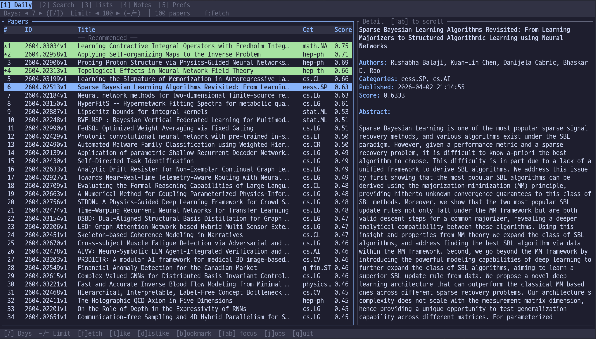

# arXiv Explorer

[](https://www.python.org/downloads/)
[](LICENSE)
[](https://github.com/Axect/arXiv_explorer/actions/workflows/ci.yml)
[](https://github.com/Axect/arXiv_explorer/stargazers)

> Discover, organize, and annotate arXiv papers from the terminal. Personalized recommendations that learn from you.



## Highlights

- **Learns from you.** Like or dislike papers and the recommendation engine adapts. No manual tuning.
- **No API keys needed.** Papers come straight from the public arXiv API. AI features use your locally installed CLI tools.
- **Fully local.** A single SQLite file on your machine. No accounts, no cloud, no tracking.
- **Terminal-native.** A Python CLI for scripting and a fast Rust TUI for browsing. Works over SSH.
- **Composable.** Export to Markdown/JSON/CSV. Integrates with [arxivterminal](https://github.com/Axect/arxivterminal) and [arxiv-doc-builder](https://github.com/Axect/arxiv-doc-builder).

## Features

| | |
|---|---|
| **Personalized Recommendations** | TF-IDF content similarity + category / keyword / recency scoring |
| **Reading Lists** | Organize papers into named lists with reading status |
| **Paper Notes** | Attach typed notes (general, question, insight, todo) |
| **AI Summaries & Reviews** | Generate via Gemini, Claude, OpenAI, Ollama, or custom provider |
| **Translation** | Translate titles and abstracts via AI |
| **Export** | Markdown, JSON, CSV for papers, lists, and notes |
| **TUI** | Native Rust terminal UI with tabs, overlays, and keyboard shortcuts |
| **Smart Caching** | Daily fetch cache avoids redundant arXiv API calls |

## Requirements

- [Python 3.11+](https://www.python.org/downloads/)
- [uv](https://docs.astral.sh/uv/) package manager
- [Rust toolchain](https://rustup.rs/) (for TUI)

## Installation

```bash
git clone https://github.com/Axect/arXiv_explorer.git
cd arXiv_explorer
uv sync

# Build the TUI
cd tui-rs && cargo build --release && cd ..
```

> **Tip:** All commands below use `uv run axp` which works without activating a virtual environment.
> For the shorter `axp`, activate the venv first (`source .venv/bin/activate`) or install globally with `uv tool install -e .`.

<details>
<summary>Shell completion (fish / bash / zsh)</summary>

```bash
uv run axp --install-completion fish   # or bash, zsh
```

</details>

## Quick Start

```bash
# 1. Set your research interests
uv run axp prefs add-category hep-ph --priority 2
uv run axp prefs add-keyword "deep learning" --weight 4

# 2. Fetch and rank recent papers
uv run axp daily --days 7 --limit 10

# 3. Launch the TUI
uv run axp tui
```

See [QUICKSTART.md](QUICKSTART.md) for a full walkthrough.

## TUI

Launch with `uv run axp tui`. Built with Rust (Ratatui + Crossterm) for snappy navigation.

| Tab | Key | What you can do |
|-----|-----|-----------------|
| **Daily** | `1` | Browse personalized papers with a detail panel |
| **Search** | `2` | Search arXiv interactively |
| **Lists** | `3` | Manage reading lists and track status |
| **Notes** | `4` | Browse and filter paper notes |
| **Prefs** | `5` | Edit categories, keywords, authors, weights, and AI config |

### Keyboard shortcuts

| Key | Action | Key | Action |
|-----|--------|-----|--------|
| `Enter` | Open detail | `f` | Fetch papers |
| `l` | Like | `b` | Bookmark |
| `d` | Dislike | `j` | Jobs panel |
| `s` | Summarize | `a` | Add (in Prefs) |
| `t` | Translate | `D` | Reset weights |
| `r` | Review | `q` | Quit |

## CLI Reference

### Paper Discovery

```
axp daily [-d DAYS] [-l LIMIT] [-s]     Fetch recent papers (personalized)
axp top   [-l LIMIT] [-s]               Top recommended papers
axp search QUERY [-l LIMIT] [-a]        Search (add -a for arXiv API)
```

### Paper Interaction

```
axp show  [ARXIV_ID] [-s] [-d] [-t]     View paper details
axp like  ARXIV_ID [-n NOTE]             Mark as interesting
axp dislike ARXIV_ID                     Mark as not interesting
axp translate ARXIV_ID                   Translate title and abstract
axp review ARXIV_ID [-f] [-t]            Generate AI review
```

### Organization

```
axp prefs                                View/manage categories and keywords
axp list                                 Manage reading lists
axp note                                 Manage paper notes
axp export                               Export to Markdown, JSON, or CSV
```

### Configuration

```
axp config show                          View current AI settings
axp config set-provider PROVIDER         Switch provider
axp config set-language LANG             Change language (en, ko)
axp config test                          Test provider connection
```

## AI Providers

AI features call external CLI tools via subprocess. No API keys are stored in the app.

| Provider | CLI tool | Notes |
|----------|----------|-------|
| **Gemini** | `gemini` | Default provider |
| **Claude** | `claude` | Uses `--output-format text` |
| **Codex** (OpenAI) | `codex` | |
| **Ollama** | `ollama` | Default model: `llama3.2` |
| **OpenCode** | `opencode` | |
| **Custom** | user-defined | Template with `{prompt}` placeholder |

```bash
axp config set-provider claude
axp config set-model "claude-sonnet-4-5-20250929"
axp config test
```

## Architecture

```
src/arxiv_explorer/              Python backend
  core/        Data models, database schema, config
  services/    Recommendation, search, summarization, caching
  cli/         Typer-based CLI commands
  utils/       Display helpers

tui-rs/                          Rust TUI frontend
  src/app.rs         App state, tabs, overlays, jobs
  src/events.rs      Key/mouse input handling
  src/main.rs        Rendering (Ratatui)
  src/categories.rs  arXiv category taxonomy
  src/commands/      Async subprocess calls to Python CLI
  src/db/            Direct SQLite access (read/write)
```

**Scoring formula** (defaults, configurable in TUI):
Content similarity 60% + Category match 20% + Keyword match 15% + Recency bonus 5%.

## Comparison with arxiv-sanity-lite

[arxiv-sanity-lite](https://github.com/karpathy/arxiv-sanity-lite) pioneered TF-IDF paper recommendations for the web. arXiv Explorer brings a similar idea to the terminal.

| | arxiv-sanity-lite | arXiv Explorer |
|---|---|---|
| **Interface** | Web UI | CLI + TUI (SSH-friendly) |
| **Recommendation** | TF-IDF (server) | TF-IDF (local) |
| **Setup** | Server deployment | `uv sync` + `cargo build` |
| **Storage** | PostgreSQL + S3 | Single SQLite file |
| **AI summaries** | No | Yes (pluggable) |
| **Reading lists & notes** | No | Yes |
| **Export** | No | Markdown, JSON, CSV |

## Integration

- **[arxivterminal](https://github.com/Axect/arxivterminal)**: Reads from its local paper database (read-only)
- **[arxiv-doc-builder](https://github.com/Axect/arxiv-doc-builder)**: Converts papers to Markdown via `axp export markdown`

## Data Storage

Everything lives in `~/.config/arxiv-explorer/explorer.db`. Single SQLite file, fully local.

## Contributing

Contributions welcome! See [CONTRIBUTING.md](.github/CONTRIBUTING.md) for guidelines.

## License

[MIT](LICENSE)
